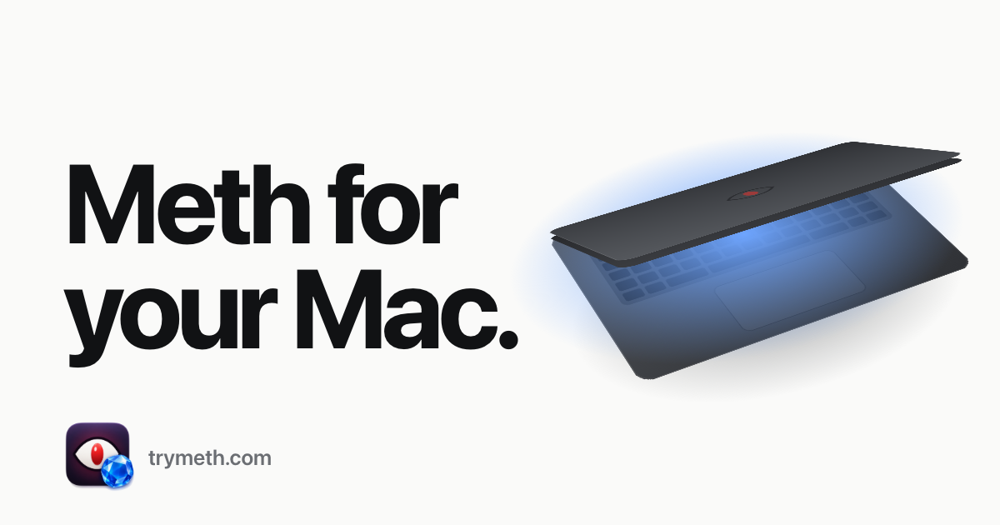

<p align="center">
  <a href="https://trymeth.com"></a>
</p>

<h1 align="center">Meth for your Mac</h1>

<p align="center">
  Keep your Mac awake, even with the lid closed.<br>
  <a href="https://trymeth.com"><b>trymeth.com</b></a> · <a href="https://trymeth.com/download/Meth.dmg">Download</a> · Free and open source · macOS 15+
</p>

Stop walking around with your laptop ajar. Meth is a small menu bar app that keeps your Mac running with the lid shut, so Claude Code, Codex, builds and downloads keep going while you carry it like a normal person.

## Modes

Meth lives in the menu bar as an eye.

| Mode | Eye | What it does |
| --- | --- | --- |
| **Off** | open pupil | Normal sleep. Meth makes no sleep request. |
| **Caffeine** | filled pupil | Prevents idle sleep while the lid is open. The display can still dim. This is the default at launch. |
| **Meth** | red pupil | Keeps the Mac awake with the lid closed. The built-in display stays on under the lid. Stays on until you turn it off. |

Left-click the eye for the menu (Off, Caffeine, Meth, Check for Updates…, Settings…, Quit). Right-click the eye to toggle Meth. The pupil turns red only after macOS confirms the setting.

## Install

1. Download [Meth.dmg](https://trymeth.com/download/Meth.dmg) from [trymeth.com](https://trymeth.com) and drag Meth to Applications. It is signed with a Developer ID and notarized by Apple.
2. Open Meth. There is no Dock icon; look for the eye in the menu bar.
3. Choose **Meth** from the menu, or from Settings. The first time, Meth explains what it will install and asks for your administrator password once.

The one-time setup installs `/etc/sudoers.d/trymeth-<your user name>`, which lets only your account run exactly `pmset -a disablesleep 1` and `pmset -a disablesleep 0` without a password. It also registers Meth Dealer, a small background helper that keeps closed-lid mode applied across power changes. It shows under Meth in **System Settings > General > Login Items & Extensions**. If macOS asks you to allow it there, turn it on and choose **Repair Closed-Lid Mode** in Settings.

Meth updates itself with [Sparkle](https://sparkle-project.org) from `https://trymeth.com/appcast.xml`.

## Safety

- **Heat and battery.** With Meth on, the screen stays on under the lid. Keep the Mac ventilated and out of bags, and turn Meth off when you are done.
- **Cutoffs.** On battery at 10% or less, Meth turns itself off and restores normal sleep. You can disable this cutoff in Settings. If macOS reports a critical thermal state, Meth always turns itself off.
- **Removal.** If Meth is trashed or deleted while it is on, Meth Dealer restores normal sleep and removes itself.
- **System-wide setting.** Closed-lid mode uses a system-wide power setting, so other sleep-control apps can conflict with it. Meth refuses to start if another app has already disabled sleep, so it can always restore your original setting.

## Settings

Mode (Off, Caffeine, Meth), **Start at login**, **Caffeinate when Meth launches**, **Turn off Meth at 10% battery**, the version with **Check for Updates…**, and **Set Up / Repair / Uninstall Closed-Lid Mode**.

## Uninstall

Open **Settings** and choose **Uninstall Closed-Lid Mode…**. Meth turns off, restores normal sleep, unregisters Meth Dealer, and asks for your administrator password once to remove your sudo rule. Then delete Meth from Applications.

To remove it by hand: run `sudo pmset -a disablesleep 0`, turn Meth off under Login Items & Extensions, then `sudo rm /etc/sudoers.d/trymeth-<your user name>`. Check that `pmset -g | grep SleepDisabled` shows `0`.

## Privacy

The app collects nothing. Its only network request is Sparkle's update check. The website uses cookieless Cloudflare Web Analytics; see [trymeth.com/privacy](https://trymeth.com/privacy).

---

## Development

Requires macOS 15+, Swift 6 (Xcode or the Command Line Tools) and Node for the site generators.

```sh
./script/build_and_run.sh           # debug build to dist/Meth.app, ad-hoc signed, launched
./script/build_and_run.sh --verify  # also checks the app stays running
./script/bundle.sh --configuration release   # universal (arm64 + x86_64) bundle, no launch
```

`script/bundle.sh` takes `--configuration debug|release`, `--arch ARCH` (repeatable) and `--sign IDENTITY` (default ad-hoc). With a Developer ID it signs inside out with the hardened runtime and a secure timestamp, including Sparkle's nested code. The version lives in `script/version.env`.

### Layout

| Path | What |
| --- | --- |
| `Sources/Meth` | Menu bar app: status item, menu, Settings, closed-lid setup (`PowerAccessSetup.swift`, `PowerAccessScript.swift`) |
| `Sources/MethDealer` | Background helper registered with `SMAppService.agent`; reconciles every 15 s and on power and thermal changes |
| `Sources/MethShared` | Preferences, `pmset` control (`PowerTool.swift`) and battery/thermal cutoffs (`SafetyCutoff.swift`) |
| `script/` | Build, bundle, release, appcast and site deploy scripts; `script/dmg/` holds the install window |
| `site/` | trymeth.com (static HTML, `site/art/` has the image and vein generators) |
| `worker/`, `wrangler.jsonc` | Cloudflare Worker: HTTPS redirect, static assets and `/api/visitors` |

### Release

1. Bump `script/version.env`.
2. Run `./script/release.sh [notes.html]`. It builds the universal app with the Developer ID identity, notarizes and staples it, builds the styled DMG with [dmgbuild](https://github.com/dmgbuild/dmgbuild), notarizes and staples that, then writes `site/download/Meth.dmg` and a signed `site/appcast.xml`.
   - It needs dmgbuild (`/usr/bin/python3 -m pip install --user dmgbuild`), the `meth-notary` notarytool profile (`xcrun notarytool store-credentials meth-notary --apple-id <apple id> --team-id Z9884J6ZQT`, run once in an interactive terminal) and the Sparkle EdDSA private key in the login keychain.
3. Deploy the site, DMG and feed together with `./script/deploy_site.sh` (needs `CLOUDFLARE_API_TOKEN` and `CLOUDFLARE_ACCOUNT_ID`; see `site/README.md`).

### How closed-lid mode works

- Meth runs `pmset -a disablesleep 1` and `0` through the per-user sudo rule, then waits for macOS to confirm the new value before recording that it owns the setting. It never takes over a sleep override another app created.
- The privileged setup script is compiled into the signed app and passed as text to the administrator prompt, with a clean environment, so no file in the app bundle runs as root. The rule is checked with `visudo -cf` and installed atomically as `root:wheel 0440`.
- Meth Dealer is registered from `Contents/Library/LaunchAgents/com.toli.trymeth.dealer.plist`. The app checks that it is actually running at launch and before turning Meth on, and re-registers it if macOS left a stale job behind.
- `disablesleep` is undocumented, so check it on each new macOS release.

## License

[MIT](LICENSE) © Toli Marchuk. Built at [heysigna.com](https://heysigna.com). The GitHub icon in Settings is from [Primer Octicons](https://github.com/primer/octicons) (MIT).
